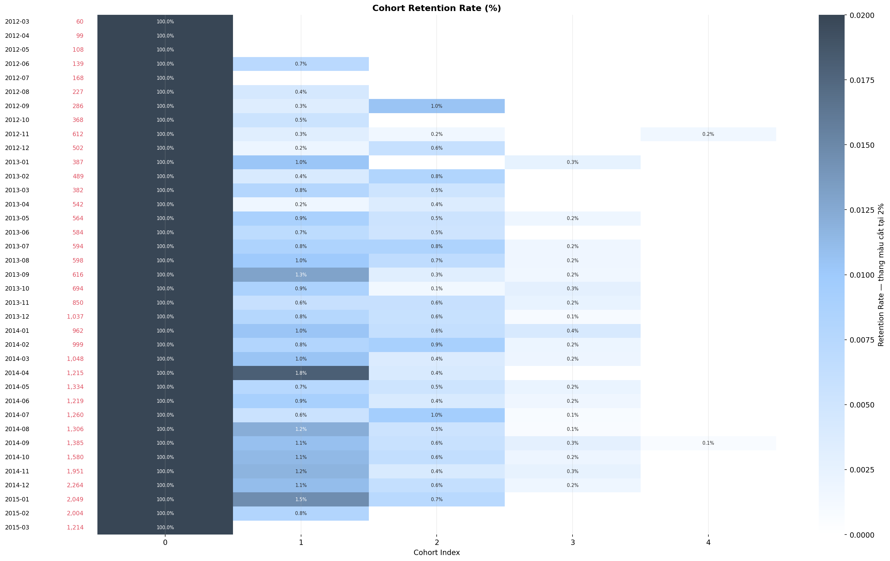
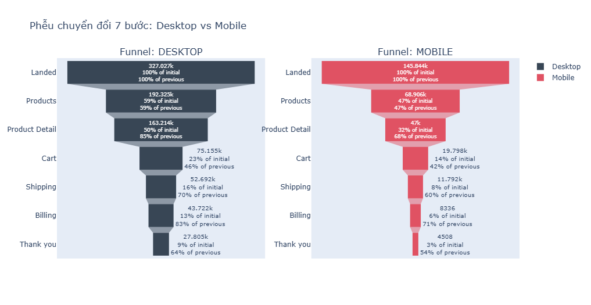
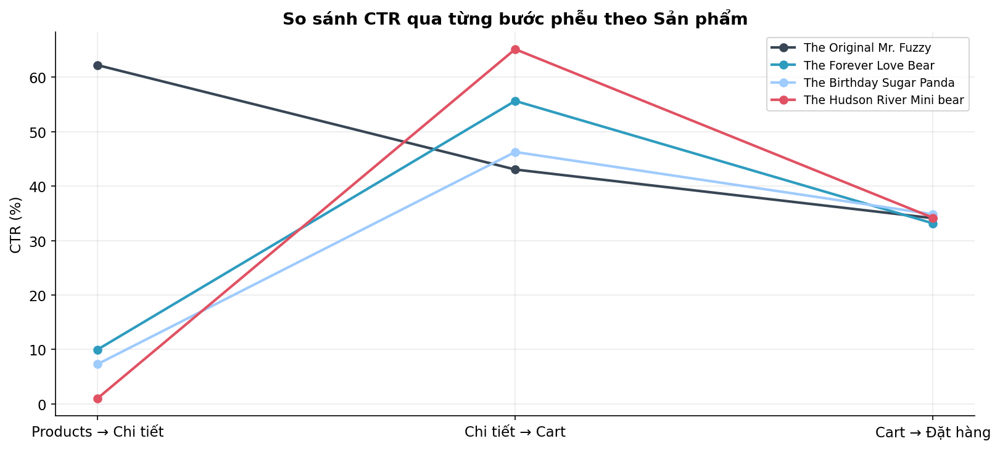

# 📊 SmartToys — Business Review & Growth Strategy

Deep-dive analysis of **472,871 web sessions** and **32,313 orders** from an e-commerce business over three years (Mar 2012 – Mar 2015), tracing where profit leaks and where growth is blocked.

📑 **[View the slide report (PDF)](reports/SmartToys_Business_Review.pdf)** · 📓 **[Full notebook](notebooks/smarttoys_business_review.ipynb)** · 🏗️ **[Analytics engineering pipeline](https://github.com/duyngoduyngo/smarttoys-analytics-pipeline)**

| Headline finding | Figure |
|---|---|
| Customers who buy exactly once | **98.14%** |
| Revenue lost to poor mobile conversion | **~$473,000** |
| Click-through to the most profitable product | **1.00%** |

---

## 1. Context & Objectives

SmartToys sells premium teddy bears online. After three years of operation revenue is growing, but leadership is concerned about blind spots: advertising spend keeps rising without clarity on which customers are worth acquiring, refund rates look abnormal on certain product lines, and the purchase funnel shows signs of friction.

> **Central question:** How do we improve profitability and customer experience over the next year?

Three concrete objectives:

- **Explain the margin gap** — separate gross revenue from what actually survives COGS and refunds
- **Locate the conversion bottleneck** — identify which step, which device, and which traffic source loses customers
- **Find the growth lever** — evaluate opportunities to raise AOV and retain customers

## 2. Data & Tech Stack

**Data:** six relational tables — `website_sessions`, `website_pageviews`, `orders`, `order_items`, `order_item_refunds`, `products`. Over 1.1 million pageview records.

**Language & libraries:** Python · pandas · numpy · matplotlib · seaborn · plotly

**Analytical techniques:**

| Technique | Question it answers |
|---|---|
| Unit Economics | Which product is actually profitable after COGS and refunds? |
| Pareto & ABC classification | How concentrated is risk across products, channels, customers? |
| RFM Segmentation | Who are the high-value customers? |
| Cohort Retention | Do customers come back? |
| Sankey Journey | How does traffic flow from source to product? |
| Conversion Funnel | Where do customers drop off? |
| Market Basket Analysis | Which products get bought together? |

## 3. The Overall Picture

| Metric | Value |
|---|---|
| Gross revenue | $1,938,509.75 |
| COGS | $722,370.25 — 37.26% of revenue |
| Refunds | $85,338.69 — 4.40% of revenue |
| **Net profit** | **$1,130,800.81 — 58.33% margin** |
| Conversion rate | 6.83% |
| AOV | $59.99 |

## 4. Three Key Findings

### 4.1. The business has almost no customer lifecycle

**98.14%** of customers buy exactly once (31,105 out of 31,696). Repeat rate is **1.86%**, month-1 retention **0.84%**, and month-3 retention **0.20%**.

Average revenue per customer is **$61.16** — essentially equal to AOV. In other words: each customer delivers a single order and disappears, so the advertising spend used to acquire them is recovered through that one order alone. Every unit of growth has to be purchased with fresh budget.



### 4.2. Mobile is the most expensive gap — and it is widening

Mobile accounts for **30.8%** of traffic but converts at just **3.09%**, against **8.50%** on desktop — a **2.75x** gap, and mobile underperforms at **every** funnel step.

Crucially, the gap appears across **all four traffic sources** without exception. If it were a traffic-quality problem, the gap would vary by channel. Its uniformity points to the website interface itself.

Supporting evidence: repeat rate on mobile (1.63%) is close to desktop (1.90%). Mobile customers are not lower quality — they simply have a harder time buying.

If mobile matched desktop's conversion rate, the business would gain **7,889 orders**, roughly **$473,000** in revenue over three years. And over the last six months, the checkout drop-off gap **widened from 10.3 to 14.2 percentage points**.



### 4.3. The most profitable product is buried

`The Hudson River Mini bear` has the **highest net margin in the catalogue (67.08%)** and the **lowest refund rate (1.28%)**. Once a customer reaches its detail page, **65.13%** add it to cart — also the highest, beating flagship `Mr. Fuzzy` (43.04%) by 22 percentage points.

Yet only **1.00%** of catalogue visitors click into it — **62x** fewer than `Mr. Fuzzy`.

This is not a desirability problem, it is a visibility problem. Meanwhile `Mr. Fuzzy` generates 62.47% of revenue but carries the **lowest net margin (55.91%)**, driven by high COGS plus 1,237 refunded orders costing $61,837.63.



## 5. Other Notable Findings

- **Refunds peak in summer, not the holiday season.** August and September both hit **7.76%** — 2.4x higher than October (3.17%) — while November and December, the highest-volume months, sit below average. Since June–September is the low season, capacity overload cannot be the cause.
- **The highest refund rate by proportion belongs to `Birthday Sugar Panda` (6.04%)**, not `Mr. Fuzzy` — refunds consume 9.67% of that product's own profit.
- **Cross-sell lifts AOV by 75.6%** ($89.25 vs $50.82), making up 23.87% of orders but 35.51% of revenue. However, **all six product pairs have Lift < 1**, meaning no genuine positive association.
- **Customer ABC classification does not follow Pareto:** it takes 74.40% of customers to reach 80% of revenue — a direct consequence of nobody buying twice.

## 6. Recommendations

| # | Action | Data basis | Owner | Expected impact | Priority |
|---|---|---|---|---|---|
| 1 | Redesign the mobile checkout flow: simplify `/billing`, integrate digital wallets | Mobile drop-off 47.72% vs desktop 33.55%, gap widening | Product | Recover ~$150K/year | High |
| 2 | Promote Hudson on the catalogue page; add cart-stage cross-sell prompts | Only 1.00% click-through but 65.13% add-to-cart; 67.08% margin | Product & Marketing | Lift Hudson revenue share from 7.76% to 15% | High |
| 3 | Audit quality and packaging for Panda and Mr. Fuzzy; add a refund-reason field | Panda refund 6.04%; Mr. Fuzzy lost $61,838 (72.5% of all refunds) | Operations | Cut refund rate below 3%, save ~$40K | High |
| 4 | Tighten packaging and warehouse controls June–September | Refund rate 7.76% in Aug–Sep, 2.4x October | Ops & Logistics | Bring summer refunds to 4.32% | High |
| 5 | Launch a repeat-purchase programme: 30-day email, second-order incentive | Repeat rate 1.86%; second-time buyers average $122–188 vs $61 | CRM | Raise repeat rate to 5% | Medium |
| 6 | Audit `/lander-3`, apply the `/lander-5` design | 96.61% drop-off across 79,000 sessions, highest on site | Product | ~5,300 additional orders | Medium |
| 7 | Cut `socialbook` spend, reallocate to `direct/organic` (SEO) | Socialbook 1.15% of revenue, 1.17% repeat, 0.83% mobile CR | Performance Media | Reduce wasted CAC | Medium |
| 8 | Add an LTV/CAC-by-cohort dashboard | No metric currently tracks long-term customer quality | Data | Measure impact of item 5 | Medium |

## 7. Limitations

Three points to state plainly when interpreting these results:

1. **RFM segmentation is constrained by the data.** The `frequency` column holds only three distinct values (1, 2, 3), so the F score resolves to three tiers rather than five. Segment names therefore reflect Recency and Monetary more than genuine loyalty.
2. **Market Basket shows no positive association.** All six product pairs have Lift < 1, because `Mr. Fuzzy` is so common that it drags every pair's lift down. The cross-sell recommendation in item 2 rests on Confidence and margin, not Lift.
3. **No refund-reason data exists.** The `order_item_refunds` table has no reason, batch, or supplier field. The causes proposed in the refund section are **hypotheses requiring verification**, not conclusions.

## 8. Repository Structure

```
smarttoys-ecommerce-analytics/
├── README.md
├── requirements.txt
├── notebooks/
│   └── smarttoys_business_review.ipynb    # Full analysis
├── data/
│   └── raw/                                # 6 source files
└── reports/
    ├── SmartToys_Business_Review.pdf       # Slide report
    ├── SmartToys_Business_Review.pptx
    └── figures/                            # 20 exported charts
```

## 9. How to Reproduce

```bash
git clone https://github.com/duyngoduyngo/smarttoys-ecommerce-analytics.git
cd smarttoys-ecommerce-analytics
pip install -r requirements.txt
jupyter notebook notebooks/smarttoys_business_review.ipynb
```

The notebook detects its environment: on Google Colab it mounts Drive, locally it uses relative paths inside the repo. The `load()` helper accepts both `.csv` and `.csv.gz`.

## 10. Related Work

This same dataset is modeled into a tested data warehouse using **dlt + DuckDB + dbt**, with 13 models across a bronze/silver/gold architecture and **93 automated data tests** — including tests derived from the exact data-quality problems encountered during this analysis.

🏗️ **[smarttoys-analytics-pipeline](https://github.com/duyngoduyngo/smarttoys-analytics-pipeline)**

All eleven headline metrics in that pipeline match this notebook exactly, computed through two fully independent paths.

## 11. License

Code in this repository is released under the [MIT License](LICENSE).

The dataset is simulated data used for educational purposes and is not covered by that license.

---

*Built by **Ngo Duc Duy** · [LinkedIn](https://www.linkedin.com/in/duyngoduyngo/) · duyngoduyngo@gmail.com*
